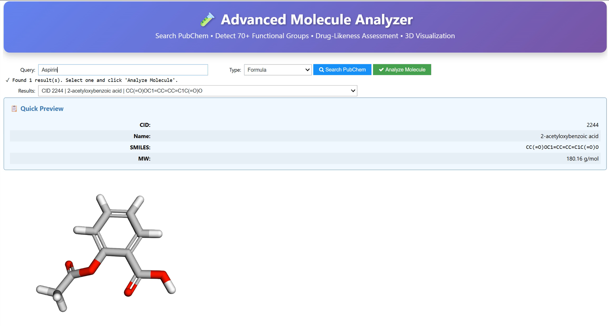
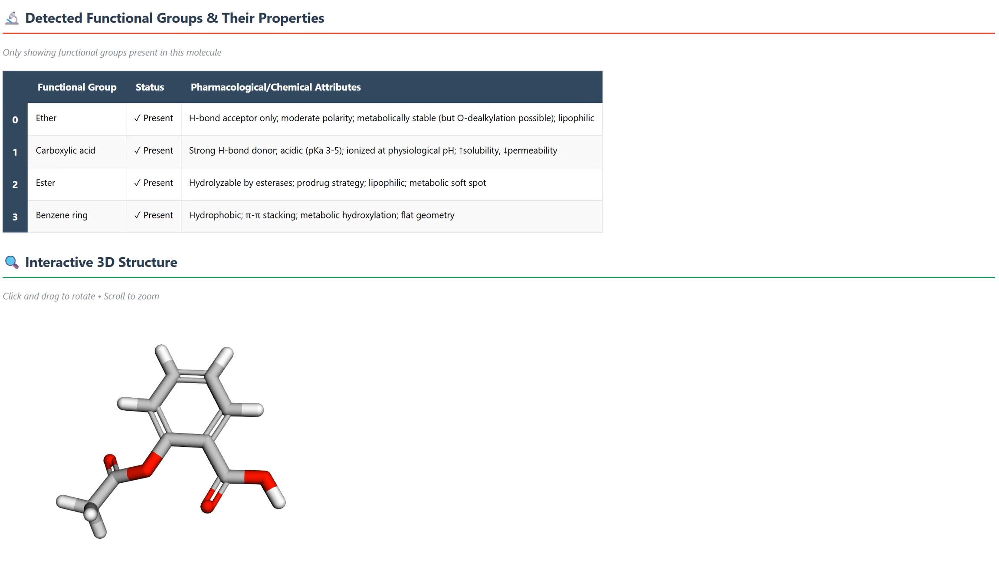
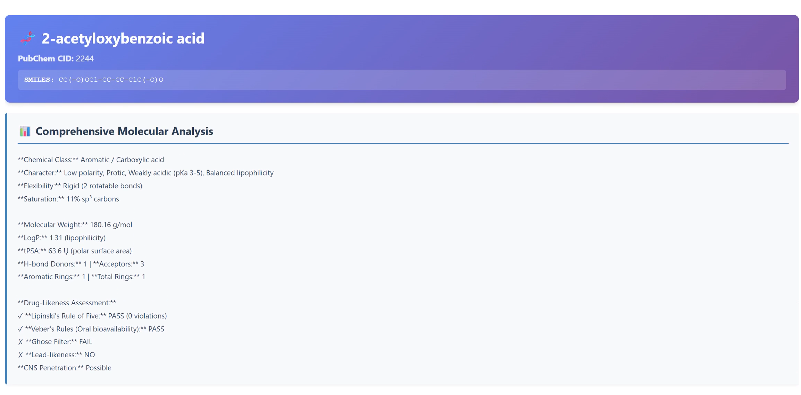

# 🧪 Intelligent Molecule Finder
**Advanced Chemical Structure Analysis & Drug-Likeness Assessment**

## 🌟 Overview
The **Intelligent Molecule Finder** is a chemical informatics tool designed to bridge the gap between raw chemical data and actionable pharmacological insights. Built with Python and RDKit, it allows users to search for molecules via PubChem and instantly perform deep structural analysis, detect over 70+ functional groups, and assess drug-likeness.

## 🚀 Key Features
*   **Multi-Format Search:** Search via SMILES, IUPAC Name, Formula, or PubChem CID.
*   **Functional Group Library:** Detects and explains 70+ functional groups (Oxygen, Nitrogen, Sulfur, Phosphorus, and Heterocycles).
*   **Drug-Likeness Assessment:** Validates against Lipinski’s Rule of Five, Veber’s Rules, and Ghose Filter.
*   **ADME Insights:** Provides CNS penetration and lead-likeness predictions.
*   **3D Visualization:** Generates and renders interactive 3D structures using py3Dmol and UFF optimization.

## 🛠️ Tech Stack
*   **Core:** Python, RDKit
*   **Data API:** PubChemPy
*   **Analysis:** Pandas, NumPy
*   **UI/Visualization:** py3Dmol, ipywidgets

## 📂 Project Structure
*   `FunctionalGroup.ipynb`: Main interactive application.
*   `Intelligent Molecule Finder Presentation.pdf`: Project methodology and documentation.
*   `1.png`, `2.png`, `3.png`: Analysis and 3D preview screenshots.
*   `API.png`: Technical overview of the PubChem integration.

## 📸 Screenshots
| Search & Preview | 3D Visualization | Analysis Report |
| :---: | :---: | :---: |
|  |  |  |

## Contact

If you'd like to connect, collaborate, or discuss this project:

- **Email:** artamohammadbeigi@gmail.com  
- **LinkedIn:** [Arta Mohammadbeigi](https://www.linkedin.com/in/arta-mohammadbeigi/)
